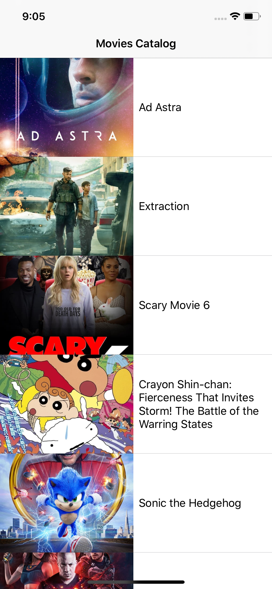
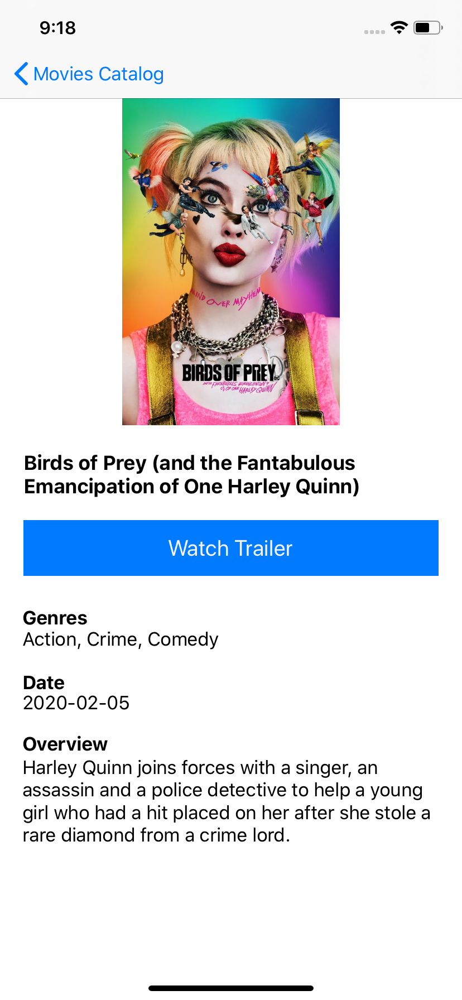
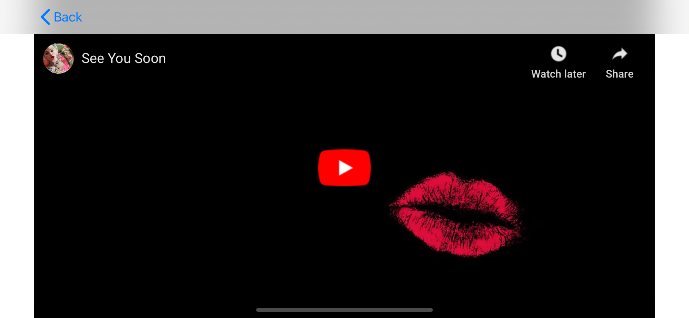

Movies app built to practice programming with Swift. The app enables to browse through the latest movies, display a short detail page of the selected movie and play the trailer. Movies data requested from the Movie Database API, source: https://developers.themoviedb.org/3/getting-started

